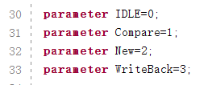

# CODH实验报告—综合项目LabH6

**2022.5.27**    **许元元 PB20511899  && 黄与进 PB20061354**

[TOC]

> **写在前面：**
>
> 项目的实现整体是基于Lab5做的，所以我们省去了原有的针对于CPU的讲述部分，着重于讲述基于原有的CPU所做的更新和升级的部分，主要内容在后续的核心代码中阐述，然后附带有一定的说明性文字。
>
> 文章的最后也有一部分的代码，相比核心部分更加完整，添加了一定的注释帮助理解。


##  **一、项目综述：**

### **1.项目名称：**

**CODH综合设计—CPU功能的完善 & 汇编程序设计 & 外设驱动**


### **2.内容总结：**

- **总体陈述：**

  - 运行一个五级流水线结构的哈佛结构CPU，支持除双字节外所有的RV32I指令

  - 进行完整的指令汇编测试

  - 对CPU添加**动态分支预测**、**L1数据cache**、支持**中断处理与现场恢复**功能

  - 外设支持：键盘输入、vga显示、音频输出模块

  - 主程序为一个递增的计数器（速度较快，是为了方便观察）

  - 在主程序运行时，如果按下键盘上“ I ”键，即跳入画布程序作为中断处理，按" Q键退出 "

  - 在运行时能够听到音频的输出

  - 如果运行中按下data键，即可做到运算相应的fib数列的值，停留一段时间后自动回到主程序

  - 返回的过程用到了我们自己定义的ret指令（Opcode：1111111）

  - 我们内置了一个秒计时器，在CPU处于Stop状态10s左右后，会自动跳入一个屏幕保护画面，展示我们的组员名单以及实现动态的背景显示

    

- **实现内容：**

  - **指令集扩充：**

    实现CPU的R32I全指令，并对所实现的指令进行了较为充分测试

    > 测试用例样图如下：

     

    


  - **CPU功能添加：**

    - **L1-数据cache**

      1. **直接相联映射**

      2. 16 * 38 的**大小** （lines * bit）

          

      3. cache**写回法**的**状态机设计**

         采用的是标准的三段式状态机设置

         > 四状态数

          

         > 状态图

           

      4. 与调整后的data_mem信号握手

    - **data_mem调整**

      1. 保留原**只读**端口用于输出check_data进行调试  
      2. 与cache通过控制信号实现握手

      > 端口示意图，详情见注释

       

    - **动态分支预测处理**

      基于PC低五位做映射到PHT中，每一单元均是2-bit BHT设计

      > 动态预测实现示意图（和实际有一点不同）

       

      > 2-bit BHT 饱和计数器分支预测方式

       

      >  BHT的更新
      
       
      
      > 根据BHT选择下一条PC
      
       
      
       

    * **中断处理的添加**

    1. **中断处理的硬件实现**

       中间寄存器的添加，用于返回的新指令的设计

       > 指令操作码opcode = 7‘b1111111

       

    2. **指定I/O中断 & 信号产生**

       将键盘I输入，运行中的data输入分别设定为两种I/O中断

       > 信号定义如下，pdu检测硬件输入信号，经过处理后产生中断信号，传入CPU中

       

       

    3. **汇编程序的编写以及中断矢量表的选定**

       - 主程序就是一个简单的递增计数器
       
       - 编写画布程序和fib程序分别作为中断处理
       
       - 中断矢量表的生成即是根据两汇编程序的首地址
       
         


  - **汇编程序设计：**

    - **画布程序**

      汇编实现方式

      - MMIO拓展，轮询获得键盘输入

      - 根据键盘输入做一系列寄存器内的算术运算

      - 通过lw, sw获得或改动画布存储程序内的颜色值

        > 按键功能列表如下

         

    - **fib程序**

      - 根据开关输入值做简单的fib运算
      - 显示在晶体管上一段时间
      - 自动退出程序
      
      


- **外设驱动：**

  - **键盘**

    - 串行读入+检验+比较确定按键

    - 调整pdu模块，拓展MMIO部分：增加kbd_state，kbd_data等

      > 原理图如下：

       
  
  - **vga显示**
  
    最主要的就是显示定时参数的设置
  
     
  
  - **音频输出**
  
    因为是预生成好的声音数据，所以其实就是一个pwm波的生成问题
    细节不多讲了，核心就是波形调制生成的部分


## **二、项目设计**

### **1. 数据通路**

  

**基本上是根据以上两个五级流水线CPU做的修改：**

- 添加了中断信号，设置了大量寄存器用于中断处理与恢复；
- 在ID阶段增加了一个ALU用于更早地判断条件跳转指令是否发生、内存读写指令目标地址是否是外设，为实现这一功能，扩展了原有的前递和停顿检测单元；
- 增加了动态分支预测模块，设置BHT寄存器，在IF阶段通过条件分支指令的地址低5位寻址从而做出预测，在ID阶段更新BHT寄存器并检查预测是否正确，如不正确则重新载入指令；
- 增加了相应的控制信号和选择器，扩展了原有的指令集；

**我们的模块的分布情况大约如下：**  

 1. **PDU调试控制模块**—PDU本身具有的功能进行继承（增添Keyboard以及中断信号）

 2. **CPU模块**—五级流水线CPU做功能的拓展

    - 中断处理的添加
    - 指令的扩展
    - 动态分支预测模块的添加

 3. **DCU模块**—根据传入的信号进行显示，采用的是640*480的分辨率，这里就不赘述了，以下是我们采用的显示参数：

      

    ​		需要显示的大量元素，我们采用了双信号的方式，即color信号(12位宽)和color_on信号(1位宽)，将color_on信号作为模块之间的显示优先级判断的依据；

 3. **cache的实现**—直接相联数据cache的实现

 5. **mem的调整**—独立至CPU以外，并与cache握手信号的添加

 （在以上这一部分罗列我们所实现的各种模块、可以参见项目文件）


### **2. 状态图**

**cache状态图**

 


## **三、项目实现**

### **1. 图像信息的获取**

1. **素材采集**

    通过浏览器搜索、PS或WPS自己绘制或截屏得到的图片文件

2. **调整大小(像素)**—py简本处理

     

3. **生成.mem文件**—matlab脚本处理

    

   > **处理后的文件列表**
   
    


### **2.核心代码：**

每个模块内部都有很关键的设计与实现代码，没法将所有的都摆放在这里，因此我们将选择一部分，结合实现代码进行文字的说明；

模块是：sram, background, counter,  cache，keyboard， CPU

> **CPU模块**体量过于庞大，不方便全文粘贴，并且是基于过去的Lab5搭建，感觉无需过多描述，这里就仅仅是针对于我们新添加的若干功能进行了注释。


#### **1. sram模块**

​	我们学习并采用了verilog代码例化RAM的语句，相比于传统的调用IP核，我们只需要调用例化所用的sram模块，以常数参数的形式传入其数据的位宽、地址宽度、深度、**mem文件名**，这四个参数，即可非常方便地生成一个存储器，省略了利用IP核例化的繁琐的步骤，对于多存储器的项目的开发非常高效且友好；

> **后续和同学以的交流以及网上查找的过程中，了解到此种异步读取数据的方式即会自动例化出BRAM的存储器，比起IP核大量使用查找表LUT单元，资源利用增长很快会更加有优势，且生成速度更快，并且分布式存储器并不稳定，其会有时因为别的模块的一些小的Bug或者运算地址时较为复杂的组合逻辑导致的延时问题而影响到其读取，导致花屏（稳定的“不稳定抖动”现象）；
> 查阅的资料显示是可以通过指定存储模块symbol来指定例化为指定的块状存储器的，但我阅读了Arti-7的芯片说明手册，也没有尝试出正确的存储器型号，于是最终相当于利用的还是默认的存储器进行例化，但我们不断对外层模块的时序等多方面进行优化，以保证项目运行的稳定性**

```verilog
`timescale 1ns / 1ps
// 通过传入参数的方式定义我们的地址位宽，数据宽度、深度以及初始化文件的名称
module sram #(
    parameter ADDR_WIDTH = 8, 
    DATA_WIDTH = 8, 
    DEPTH = 256, 
    MEMFILE = ""
    )(
    input wire clk,
    input wire [ADDR_WIDTH-1:0] addr,
    input wire write_en,
    input wire [DATA_WIDTH-1:0] data_in,
    output reg [DATA_WIDTH-1:0] data_out
    );
    reg [DATA_WIDTH-1:0] memory_array[0:DEPTH-1];

    initial begin
        if (MEMFILE > 0)
        begin
            $display("Loading memory init file '" + MEMFILE + "' into array.");
            $readmemh(MEMFILE, memory_array);
        end
    end

    always @(posedge clk) begin
        if(write_en) begin
            memory_array[addr] <= data_in;
        end
        else begin
            data_out <= memory_array[addr];
        end
    end
    
endmodule
```


#### **2. background模块**

​	**亮点说明：**

1. 采用了将一32*32的像素块循环显示铺满背景的方式，并且**为显示效果而加上了x_offset和y_offset两组偏移量**；
2. **x_offset为[0,31]内不断变化的，实现背景滚动的动态效果；**
3. **y_offset也为[0,31]内不断变化的，但是尚未启用；**
4. 其实通过启用**y**并调整**x_offset**和**y_offset**的值可以控制倾斜的屏幕图像滚动并且可调整角度。

​	**以下的代码块我仅罗列了亮点部分**

```verilog
    //地址的转换部分
    // assign addr = vga_x + 640 * vga_y;

    //addr_x，addr_y为将显示坐标vga_x,vga_y做mod 32操作，从而形成转换为32*32图像上的坐标值，可根据这组坐标算其显示地址
    assign addr_x = vga_x % 32;
    assign addr_y = vga_y % 32;

    //addr_x_m，addr_y_m为添加完显示效果后的坐标值，也就是添加了x_offset和y_offset变量，并做了越界判断，使得可循环显示
    assign addr_x_m = ( ( addr_x + x_offset ) >= 32 ) ? ( addr_x + x_offset - 32 ) : ( addr_x + x_offset );
    assign addr_y_m = ( ( addr_y + y_offset ) >= 32 ) ? ( addr_y + y_offset - 32 ) : ( addr_y + y_offset );

    //计算考虑了显示效果后的我们传递给ram的地址值，取出图像信息
    assign addr_ram = ( ( addr_x_m + 32 * addr_y_m ) >= 1024 ) ? ( addr_x_m + 32 * addr_y_m -1024 ) : ( addr_x_m + 32 * addr_y_m );

    //计数器做分频器，使得获得一个区间递增的count信号，上限为1000000
    counter #(20, 0, 1000000) frequency_divider_counter(.clk(clk), .rstn(rstn), .pe(1'b0), .ce(1'b1), .d(20'd0), .q(count));
        
    //接受count的信号，每次count值为1000000时使能置1，计数一次，即使x_offset加一，32次为一个周期，正是我们图层的水平像素数
    counter #(5, 0, 31) offset_counter(.clk(clk), .rstn(rstn), .pe(1'b0), .ce(count == 1000000), .d(5'd0), .q(x_offset));

endmodule
```


#### **3. counter模块**

你可能已经注意到了我们在background中大量地使用counter模块，这个模块本身其实很简单，就是模拟了模电课上学过的芯片功能以及端口搭建的module。

但是通过**传参**的方式，使得此模块的例化以及个性化定制变得十分容易且方便。

比如说上述的background模块实现的动态效果，关键就即是通过计数器模块实现的最后两个例化程序。

```verilog
`timescale 1ns / 1ps
//这是一个简单的DATA_WIDTH进制异步清零同步置数递增计数器
module counter #(
    parameter DATA_WIDTH = 16, RST_VLU = 0, LIMIT = 1024
    )(
    input clk, rstn, pe, ce,
    input [DATA_WIDTH-1:0] d,
    output reg [DATA_WIDTH-1:0] q
    );
    
    always @(posedge clk, negedge rstn) begin
        if (!rstn) q <= RST_VLU;
        else if (pe) q <= d;
        else if (ce) begin
            if (q == LIMIT) q <= 0;
            else q <= q + 1;
        end
    end
    
endmodule

```


#### **4. cache 模块**

**直接相联映射法**

16 * 38 的**大小** （lines * bit） 

cache**写回法**的**状态机设计**

与调整后的data_mem进行接口信号握手

```verilog
//直接相联cache，cache大小为16块，主存大小为256块，1块=1字=32bit
//主存地址为8位，其中无块内偏移，[3:0]是索引，[7:4]是Tag
//cache V+D+Tag+Data=1+1+4+32=38

`timescale 1ns / 1ps
module cache(
    input clk,
    input rstn,
    // cpu<->cache
    input [7:0]cpu_req_addr,
    input cpu_req_row,
    input cpu_req_valid,
    input [31:0]cpu_data_write,
    output reg [31:0]cpu_data_read,
    output reg cpu_ready,
    // cache<->memory
    output reg [7:0]mem_req_addr,
    output reg mem_req_row,
    output reg mem_req_valid,
    output reg [31:0]mem_data_write,
    input [31:0]mem_data_read,
    input mem_ready
    );

// 位定义
parameter V = 37;
parameter D = 36;
parameter TagMSB = 35;
parameter TagLSB = 32;
parameter BlockMSB = 31;
parameter BlockLSB = 0 ;

// 状态数设计
parameter IDLE=0;
parameter Compare=1;
parameter New=2;
parameter WriteBack=3;

reg [37:0] cache_data [0:15];           // 37:V, 36:D, [35:32]:TAG, [31:0]DATA
reg [1:0] state, next_state;
reg hit;

wire [3:0]cpu_req_index;
wire [3:0]cpu_req_tag;

assign cpu_req_index=cpu_req_addr[3:0];
assign cpu_req_tag=cpu_req_addr[7:4];

integer i;
//初始化cache
initial
begin
    for(i = 0; i < 16; i = i + 1)
        cache_data[i] = 38'd0;
end

//直接相联cache，cache大小为16块，主存大小为256块，1块=1字=32bit
//主存地址为8位，其中无块内偏移，[3:0]是索引，[7:4]是Tag
//cache V+D+Tag+Data=1+1+4+32=38


always@(posedge clk, negedge rstn)
    if(!rstn)
        state<=IDLE;
    else
        state<=next_state;

always@(*)
case(state)
    IDLE:if(cpu_req_valid)
            next_state = Compare;
         else
            next_state = IDLE;
    Compare:if(hit)
                   next_state = IDLE;
    else if(cache_data[cpu_req_index][V:D]==2'b11)  // block is valid and dirty → go to WriteBack
                   next_state=WriteBack;
               else 
                   next_state=New;
    New:if(mem_ready)
                   next_state=Compare;
             else
                   next_state=New;
    WriteBack:if(mem_ready)
                   next_state=New;
              else
                   next_state=WriteBack;
      default:next_state=IDLE;
endcase

always@(*)
if(state==Compare)
    if(cache_data[cpu_req_index][37]&&cache_data[cpu_req_index][TagMSB:TagLSB]==cpu_req_tag)
        hit=1'b1;
    else
        hit=1'b0;

always@(posedge clk) begin
    if(state == New) begin                 //read new block from memory to cache
        if(!mem_ready) begin
            mem_req_addr <= cpu_req_addr;
            mem_req_row <= 1'b0;
            mem_req_valid <= 1'b1; 
        end
        else begin
            mem_req_valid <= 1'b0;
            cache_data[cpu_req_index][BlockMSB:BlockLSB] <= mem_data_read;
            cache_data[cpu_req_index][V:D] <= 2'b10;
            cache_data[cpu_req_index][TagMSB:TagLSB] <= cpu_req_tag;
        end
    end
    else if(state==WriteBack) begin                    //write dirty block to memory
        if(!mem_ready) begin
            mem_req_addr <= {cache_data[cpu_req_index][TagMSB:TagLSB],cpu_req_index};
            mem_req_row <= 1'b1;
            mem_data_write <= cache_data[cpu_req_index][BlockMSB:BlockLSB];
            mem_req_valid <= 1'b1;
        end
        else
            mem_req_valid<=1'b0;
    end
    else
        mem_req_valid=1'b0;
end

always@(posedge clk)
    if(state == Compare && hit)
        if(cpu_req_row==1'b0)              //read hit
        begin
            cpu_ready <= 1'b1;
            cpu_data_read <= cache_data[cpu_req_index][31:0];
        end
        else                               //write hit, Dirty → 1
        begin
            cpu_ready<=1'b1;
            cache_data[cpu_req_index][31:0]=cpu_data_write;
            cache_data[cpu_req_index][D]=1'b1;
        end
    else
        cpu_ready<=1'b0;

endmodule
```

> 即cache运行时通过置cpu_ready为0，以此中断CPU的运行直到我们的cache准备好输出的数据。
>
> 至于cache与mem的握手在接口处也有了较为具体的说明。

 

 cache的工作原理见代码和状态机即可

**说明：**

1. cache运行时通过置cpu_ready为0，以此中断CPU的运行直到我们的cache准备好输出的数据

2. cpu_req_row表示是读操作或者写操作；

3. 如果是写数据，需要判断“ V位为1 && 比较tag命中 ”

   V位为0表示此cache仍旧为空，为1表示装填的有数据

4. 如果是写命中，当即将数据存入cache内存单元，而且将数据的D位（即dirty位）置1，表示数据与主存内的不一致

5. 而后下一次命中，无论是读或写，只要命中并且dirty为1，都会跳转到WriteBack状态，与mem进行沟通，做写回操作，即将cache内的数据更新到与主存一致

6. 更新过后或命中未更新数据，最后都将cpu_rdy置为1，以恢复CPU的运行

   

#### **5. mem 模块**

```verilog
`timescale 1ns / 1ps

module cache(
    input clk,
    input rstn,
    // cpu<->cache
    input [7:0]cpu_req_addr,
    input cpu_req_row,
    input cpu_req_valid,
    input [31:0]cpu_data_write,
    output reg [31:0]cpu_data_read,
    output reg cpu_ready,
    // cache<->memory
    output reg [7:0]mem_req_addr,
    output reg mem_req_row,
    output reg mem_req_valid,
    output reg [31:0]mem_data_write,
    input [31:0]mem_data_read,
    input mem_ready
    );

parameter V = 37;
parameter D = 36;
parameter TagMSB = 35;
parameter TagLSB = 32;
parameter BlockMSB = 31;
parameter BlockLSB = 0 ;

parameter IDLE=0;
parameter Compare=1;
parameter New=2;
parameter WriteBack=3;

reg [37:0] cache_data [0:15];           // 37:V, 36:D,[35:32]:TAG,[31:0]DATA
reg [1:0] state, next_state;
reg hit;

wire [3:0]cpu_req_index;
wire [3:0]cpu_req_tag;

assign cpu_req_index=cpu_req_addr[3:0];
assign cpu_req_tag=cpu_req_addr[7:4];

integer i;
//初始化cache
initial
begin
    for(i = 0; i < 16; i = i + 1)
        cache_data[i] = 38'd0;
end

//直接相联cache，cache大小为16块，主存大小为256块，1块=1字=32bit
//主存地址为8位，其中无块内偏移，[3:0]是索引，[7:4]是Tag
//cache V+D+Tag+Data=1+1+4+32=38


always@(posedge clk, negedge rstn)
    if(!rstn)
        state<=IDLE;
    else
        state<=next_state;

always@(*)
case(state)
    IDLE:if(cpu_req_valid)
            next_state = Compare;
         else
            next_state = IDLE;
    Compare:if(hit)
                   next_state = IDLE;
               else if(cache_data[cpu_req_index][V:D]==2'b11)               //if the block is valid and dirty then go to WriteBack
                   next_state=WriteBack;
               else 
                   next_state=New;
    New:if(mem_ready)
                   next_state=Compare;
             else
                   next_state=New;
    WriteBack:if(mem_ready)
                   next_state=New;
              else
                   next_state=WriteBack;
      default:next_state=IDLE;
endcase

always@(*)
if(state==Compare)
    if(cache_data[cpu_req_index][37]&&cache_data[cpu_req_index][TagMSB:TagLSB]==cpu_req_tag)
        hit=1'b1;
    else
        hit=1'b0;

always@(posedge clk) begin
    if(state == New) begin                 //read new block from memory to cache
        if(!mem_ready) begin
            mem_req_addr <= cpu_req_addr;
            mem_req_row <= 1'b0;
            mem_req_valid <= 1'b1; 
        end
        else begin
            mem_req_valid <= 1'b0;
            cache_data[cpu_req_index][BlockMSB:BlockLSB] <= mem_data_read;
            cache_data[cpu_req_index][V:D] <= 2'b10;
            cache_data[cpu_req_index][TagMSB:TagLSB] <= cpu_req_tag;
        end
    end
    else if(state==WriteBack) begin                    //write dirty block to memory
        if(!mem_ready) begin
            mem_req_addr <= {cache_data[cpu_req_index][TagMSB:TagLSB],cpu_req_index};
            mem_req_row <= 1'b1;
            mem_data_write <= cache_data[cpu_req_index][BlockMSB:BlockLSB];
            mem_req_valid <= 1'b1;
        end
        else
            mem_req_valid<=1'b0;
    end
    else
        mem_req_valid=1'b0;
end

always@(posedge clk)
    if(state == Compare && hit)
        if(cpu_req_row==1'b0)              //read hit
        begin
            cpu_ready <= 1'b1;
            cpu_data_read <= cache_data[cpu_req_index][31:0];
        end
        else                               //write hit, D置为1
        begin
            cpu_ready<=1'b1;
            cache_data[cpu_req_index][31:0]=cpu_data_write;
            cache_data[cpu_req_index][D]=1'b1;
        end
    else
        cpu_ready<=1'b0;

endmodule
```


#### **6. keyboard module**

```verilog
//键盘控制模块，识别传入的键盘数据信号
// 后续将在PDU内进行去抖动、取边沿，以及长按连续增加操作（间隔一段时间发送一脉冲信号）
`timescale 1ns / 1ps
module keyboard(
    input clk,
    input data,
    output [12:0] ctrl_bus //ctrl_bus for painter
	);
    
    // 记录传入的键盘数据信息，因传入做判断等有时序问题需要暂时存储
    reg [7:0] data_curr;
    reg [7:0] data_pre;
    
    // 记录每个信号的触发情况
    // direction
    reg keyU, keyW, keyA, keyS, keyD;
    // color
    reg keyJ, keyK, keyL;
    // input
    reg keyI, keyO, keyP;
    // exit
    reg keyQ;
    // draw
    reg keySp;
    reg [7:0] key_correct;
    reg [3:0] b;
    reg flag;
    
parameter W = 8'h1d, A = 8'h1c, S = 8'h1b, D = 8'h23,
    Space = 8'h29, I = 8'h43, J = 8'h3b, K = 8'h42,
    L = 8'h4b, P = 8'h4d, Q = 8'h15, U = 8'h3c, O = 8'h44;
    
initial begin
    b=4'h1;
    flag=1'b0;
    data_curr=8'h00;
    data_pre=8'h00;
end


always @(negedge ps2_clk)
  begin
    case(cnt)
      1: ;
      //第一字节为空
        2: ps2_data_curr[0]<=ps2_data; // 串行输入数据位2
        3: ps2_data_curr[1]<=ps2_data; // 串行输入数据位3
        4: ps2_data_curr[2]<=ps2_data; // 串行输入数据位4
        5: ps2_data_curr[3]<=ps2_data; // 串行输入数据位5
        6: ps2_data_curr[4]<=ps2_data; // 串行输入数据位6
        7: ps2_data_curr[5]<=ps2_data; // 串行输入数据位7
        8: ps2_data_curr[6]<=ps2_data; // 串行输入数据位8
        9: ps2_data_curr[7]<=ps2_data; // 串行输入数据位9
      10:
        flag<=1'b1; // P
      11:
        flag<=1'b0;  // 终值位
    endcase
    // 记录—十一个数据为一组
    if( cnt <= 10 )
      cnt <= cnt+1;
    else if( cnt == 11 )
      cnt <= 1;
  end

// 判断键盘数据的对应情况
always @(posedge flag) begin
    if( data_curr==W || data_curr==A || data_curr==S || 
        data_curr==D || data_curr==Space || data_curr==I ||
        data_curr==J || data_curr==K || data_curr==L ||
        data_curr==P || data_curr==Q || data_curr==O ||
        data_curr==U || data_curr==8'hf0 )
        key_correct <= data_curr;
    else
        key_correct <= 8'h00;
end

// 将键盘的数据输入情况转为并行输出的键盘按键使能信号情况
always@(negedge flag) begin
    if(key_correct==8'h00) ;
    else begin
        if(data_pre == 8'hf0) begin
            case(key_correct)
                W: keyW<=0;
                A: keyA<=0;
                S: keyS<=0;
                D: keyD<=0;
                Space: keySp<=0;
                I: keyI<=0;
                J: keyJ<=0;
                K: keyK<=0;
                L: keyL<=0;
                P: keyP<=0;
                Q: keyQ<=0;
                O: keyO<=0;
                U: keyU<=0;
                default: ;
            endcase
        end
        else if(key_correct==8'hf0) ;
        else begin
            case(key_correct)
            W: keyW<=1;
            A: keyA<=1;
            S: keyS<=1;
            D: keyD<=1;
            Space: keySp<=1;
            I: keyI<=1;
            J: keyJ<=1;
            K: keyK<=1;
            L: keyL<=1;
            P: keyP<=1;
            Q: keyQ<=1;
            O: keyO<=1;
            U: keyU<=1;
            endcase
        end
        data_pre <= key_correct;
    end
end
    
// 按键使能信号的并行输出
assign  ctrl_bus = { keyU, keyW, keyA, keyS, keyD, keyJ, keyK, keyL, keySp, keyI, keyO, keyP, keyQ };

endmodule
```


#### **7. audio_unit module**

```verilog
`timescale 1ns / 1ns

module wave_generator(
    input wire clk,
    input wire [15:0] freq,
    output reg signed [9:0] wave_out
);
    reg [5:0] i;
    reg signed [7:0] amplitude [0:63];
    reg [15:0] counter = 0;

    initial begin
        amplitude[0] = 0;
        amplitude[1] = 7;
        amplitude[2] = 13;
        amplitude[3] = 19;
        amplitude[4] = 25;
		
        ... // data list
        
        amplitude[59] = -30;
        amplitude[60] = -25;
        amplitude[61] = -19;
        amplitude[62] = -13;
        amplitude[63] = -7;
    end

    always @ (posedge clk) begin
      if (freq == 0) wave_out <= 0;
      else if (counter == freq) begin
        counter <= 0;
        wave_out <= $signed(amplitude[i]);
        i <= i + 1;
        if (i == 63) i <= 0; 
        else i <= i + 1;
      end 
      else counter <= counter + 1;
    end
endmodule

module audio_output(
  input wire clk,
  output reg out
);
    wire signed [9:0] ch[0:4];
    wire signed [11:0] wave_sum;
    wire [11:0] positive_wave_sum;
    wire [15:0] freq_count [0:4];
    reg [9:0] PWM;
    reg [31:0] music_data [0:79];
    reg [31:0] music_data2 [0:79];
    reg [31:0] music_data3 [0:180];
    reg [31:0] play_counter;
    reg [15:0] note_counter = 0;
    reg [15:0] note_counter1 = 0;
    reg [31:0] note_data[0:1];
    reg [31:0] note_data2;
    wave_generator ch0(clk, freq_count[0], ch[0]);
    wave_generator ch1(clk, freq_count[1], ch[1]);
    wave_generator ch2(clk, freq_count[2], ch[2]);
    assign freq_count[0] = note_data[0][31:16];
    assign freq_count[1] = note_data[1][31:16];
    assign freq_count[2] = note_data2[31:16];
    assign wave_sum = ch[2] + ch[1] + ch[0];
    assign positive_wave_sum = wave_sum * 2 + 512;
    
    initial begin
    music_data[0] = 32'h0000010a;
    music_data[1] = 32'h1284010a;
    music_data[2] = 32'h1754010a;

    ...... // data list
        
    music_data3[162] = 32'h22f4018f;
    music_data3[163] = 32'h316e0085;
    music_data3[164] = 32'h2ea8031f;

    end
        parameter NOTES = 80;
        parameter BASS = 9'd165;
        parameter PLAY_DELAY = 100_000 - 1;
    always @ (posedge clk) begin
         if (play_counter == PLAY_DELAY) begin
           play_counter <= 0; 
           if (note_data2[15:0] == 0) begin
                   if (note_counter1 == BASS | note_counter1 == 0) begin 
                      note_counter1 <= 1; 
                      note_data2 <= music_data3[0]; 
                      note_counter <= 1;  
                      note_data[0] <= music_data[0]; 
                      note_data[1] <= music_data2[0];
                      end
                   else begin 
                      note_counter1 <= note_counter1 + 1;
                      note_data2 <= music_data3[note_counter1]; 
                      end
                   end 
             else note_data2[15:0] <= note_data2[15:0] - 1; 
           if (note_data[0][15:0] == 0) begin
               if (note_counter == 0) begin 
                   note_counter <= 1;  
                   note_data[0] <= music_data[0];  
                   note_data[1] <= music_data2[0];
               end
               else if (note_counter < NOTES) begin 
                   note_counter <= note_counter + 1; 
                   note_data[0] <= music_data[note_counter];  
                   note_data[1] <= music_data2[note_counter]; 
               end
           end 
             else note_data[0][15:0] <= note_data[0][15:0] - 1;
         end 
        else play_counter <= play_counter + 1; 
        if (PWM < $unsigned(positive_wave_sum)) 
            out <= 1;
        else 
            out <= 0;
        PWM <= PWM + 1;
    end
endmodule
```

音频输出模块的实现本质上其实就是一个PWM波形的调制，我们这里即是根据我已有的存下来的data值进行一个综合的调制；

亮点可能在于我们采用了将三段声音素材调制到一同输出的实现，即类似模拟我们正常的乐声中的鼓点、bass、主旋律等部分的结合；

有难度是在于我们的实现需要将多个发音不一致的音频叠加成同一段pwm波输出，毕竟我们的波形输出接口只有一个一位宽度的接口。


#### **8. 中断处理**

```verilog
//中断处理在CPU内部实现，由于CPU代码接近900行，占用太多空间，此处仅给出与中断有关的部分

//中断信号定义
input int_keyboard,//键盘中断产生
input int_btn,//有按键按下时为1
wire int_signal;
assign int_signal = int_keyboard | int_btn;

//中断恢复寄存器用于保存现场，每一级流水线寄存器都有对应的中断恢复寄存器，比如EX/MEM阶段(之后的代码都只拿EX/MEM流水线寄存器举例，其他阶段类似)
//EX_MEM register
reg [2:0]EX_MEM_ALUOp,EX_MEM_AndMux, EX_MEM_MemtoReg;
reg EX_MEM_RegWrite, EX_MEM_MemRead,EX_MEM_MemWrite,EX_MEM_Branch,  EX_MEM_ALUSrc,EX_MEM_JalrEn,EX_MEM_JalEn;
reg [4:0]EX_MEM_rs1, EX_MEM_rs2, EX_MEM_rd;
reg [31:0]EX_MEM_Reg1, EX_MEM_Reg2, EX_MEM_imm, EX_MEM_alu_result, EX_MEM_alu_EX_in2, EX_MEM_pc,EX_MEM_io_din,EX_MEM_instr;
reg [6:0]EX_MEM_funct7;
reg [2:0]EX_MEM_funct3;
//EX_MEM interrupt store register
reg [2:0]EX_MEM_ALUOp_int,EX_MEM_AndMux_int, EX_MEM_MemtoReg_int;
reg EX_MEM_RegWrite_int, EX_MEM_MemRead_int,EX_MEM_MemWrite_int,EX_MEM_Branch_int,  EX_MEM_ALUSrc_int, EX_MEM_JalrEn_int, EX_MEM_JalEn_int;
reg [4:0]EX_MEM_rs1_int, EX_MEM_rs2_int, EX_MEM_rd_int;
reg [31:0]EX_MEM_Reg1_int, EX_MEM_Reg2_int, EX_MEM_imm_int, EX_MEM_alu_result_int, EX_MEM_alu_EX_in2_int, EX_MEM_pc_int, EX_MEM_io_din_int,EX_MEM_instr_int;
reg [6:0]EX_MEM_funct7_int;
reg [2:0]EX_MEM_funct3_int;

//中断发生时保存现场
always@(posedge clk or negedge rstn)//EX_MEM interrupt store register
    begin 
    if(rstn==0)
        begin
        EX_MEM_ALUOp_int=0;EX_MEM_AndMux_int=0; EX_MEM_MemtoReg_int=0;
        EX_MEM_RegWrite_int=0; EX_MEM_MemRead_int=0;EX_MEM_MemWrite_int=0;EX_MEM_Branch_int=0;
        EX_MEM_ALUSrc_int=0;EX_MEM_JalrEn_int=0;EX_MEM_JalEn_int=0;
        EX_MEM_rs1_int=0; EX_MEM_rs2_int=0; EX_MEM_rd_int=0;EX_MEM_instr_int=0;
        EX_MEM_Reg1_int=0; EX_MEM_Reg2_int=0; EX_MEM_imm_int=0;EX_MEM_pc_int=0;EX_MEM_io_din_int=0;
        end
    else if(int_signal==1)//中断发生时，保护现场
        begin
        EX_MEM_ALUOp_int=EX_MEM_ALUOp;EX_MEM_AndMux_int=EX_MEM_AndMux; EX_MEM_MemtoReg_int=EX_MEM_MemtoReg;
        EX_MEM_RegWrite_int=EX_MEM_RegWrite; EX_MEM_MemRead_int=EX_MEM_MemRead; EX_MEM_MemWrite_int=EX_MEM_MemWrite; EX_MEM_Branch_int=EX_MEM_Branch;
        EX_MEM_ALUSrc_int=EX_MEM_ALUSrc;EX_MEM_JalrEn_int=EX_MEM_JalrEn;EX_MEM_JalEn_int=EX_MEM_JalEn;
        EX_MEM_rs1_int=EX_MEM_rs1; EX_MEM_rs2_int=EX_MEM_rs2; EX_MEM_rd_int=EX_MEM_rd;EX_MEM_instr_int=EX_MEM_instr;
        EX_MEM_Reg1_int=EX_MEM_Reg1; EX_MEM_Reg2_int=EX_MEM_Reg2; EX_MEM_imm_int=EX_MEM_imm;
        EX_MEM_alu_result_int=EX_MEM_alu_result; EX_MEM_alu_EX_in2_int=EX_MEM_alu_EX_in2;EX_MEM_pc_int=EX_MEM_pc; EX_MEM_io_din_int=EX_MEM_io_din;
        end
    end

//流水线寄存器对中断信号的检测、响应以及中断处理程序结束后返回主程序
always@(posedge clk or negedge rstn)//EX_MEM register
    begin 
    if(rstn==0||int_signal==1)//复位或中断发生时，清空流水线寄存器
        begin
        EX_MEM_ALUOp=0;EX_MEM_AndMux=0; EX_MEM_MemtoReg=0;
        EX_MEM_RegWrite=0; EX_MEM_MemRead=0;EX_MEM_MemWrite=0;EX_MEM_Branch=0;
        EX_MEM_ALUSrc=0;EX_MEM_JalrEn=0;EX_MEM_JalEn=0;
        EX_MEM_rs1=0; EX_MEM_rs2=0; EX_MEM_rd=0;EX_MEM_instr=0;
        EX_MEM_Reg1=0; EX_MEM_Reg2=0; EX_MEM_imm=0;EX_MEM_pc=0;EX_MEM_io_din=0;
        end
    else if(MEM_WB_instr[6:0] == 7'b1111111)	//ret指令到WB阶段时，从中断程序中返回
        begin
        EX_MEM_ALUOp=EX_MEM_ALUOp_int;EX_MEM_AndMux=EX_MEM_AndMux_int; EX_MEM_MemtoReg=EX_MEM_MemtoReg_int;
        EX_MEM_RegWrite=EX_MEM_RegWrite_int; EX_MEM_MemRead=EX_MEM_MemRead_int;EX_MEM_MemWrite=EX_MEM_MemWrite_int; EX_MEM_Branch=EX_MEM_Branch_int;
        EX_MEM_ALUSrc=EX_MEM_ALUSrc_int;EX_MEM_JalrEn=EX_MEM_JalrEn_int;EX_MEM_JalEn=EX_MEM_JalEn_int;
        EX_MEM_rs1=EX_MEM_rs1_int; EX_MEM_rs2=EX_MEM_rs2_int; EX_MEM_rd=EX_MEM_rd_int;EX_MEM_instr=EX_MEM_instr_int;
        EX_MEM_Reg1=EX_MEM_Reg1_int; EX_MEM_Reg2=EX_MEM_Reg2_int; EX_MEM_imm=EX_MEM_imm_int;
        EX_MEM_alu_result=EX_MEM_alu_result_int;EX_MEM_alu_EX_in2=EX_MEM_alu_EX_in2_int;EX_MEM_pc=EX_MEM_pc_int; EX_MEM_io_din=EX_MEM_io_din_int;
        end
    else 		//程序正常运行时
        begin
        EX_MEM_ALUOp=ID_EX_ALUOp;EX_MEM_AndMux=ID_EX_AndMux; EX_MEM_MemtoReg=ID_EX_MemtoReg;
        EX_MEM_RegWrite=ID_EX_RegWrite; EX_MEM_MemRead=ID_EX_MemRead;EX_MEM_MemWrite=ID_EX_MemWrite; EX_MEM_Branch=ID_EX_Branch;
        EX_MEM_ALUSrc=ID_EX_ALUSrc;EX_MEM_JalrEn=ID_EX_JalrEn;EX_MEM_JalEn=ID_EX_JalEn;
        EX_MEM_rs1=ID_EX_rs1; EX_MEM_rs2=ID_EX_rs2; EX_MEM_rd=ID_EX_rd;EX_MEM_instr=ID_EX_instr;
        EX_MEM_Reg1=ID_EX_Reg1; EX_MEM_Reg2=alu_EX_in2_in; EX_MEM_imm=ID_EX_imm;
        EX_MEM_alu_result=alu_result;EX_MEM_alu_EX_in2=alu_EX_in2;EX_MEM_pc=ID_EX_pc;EX_MEM_io_din=ID_EX_io_din;
        end
    end
```


#### **9. 动态分支预测**

```verilog
//分支历史寄存器
reg [1:0] BHT [31:0];

//分支预测错误信号
wire error_should_branch, error_should_not_branch;   

//本该跳转
assign error_should_branch = (opcode == 7'b1100011) && (PCSrc == 1) && (BHT[IF_ID_pc[4:0]][1] == 0) && (stall != 1); 

//本不应该跳转
assign error_should_not_branch = (opcode == 7'b1100011)  && (PCSrc == 0) && (BHT[IF_ID_pc[4:0]][1] == 1) && (stall != 1);

//BHT的更新
always@(posedge clk)begin       
    if(opcode == 7'b1100011)begin   //遇到条件分支指令时
        if( (PCSrc == 1) && (BHT[IF_ID_pc[4:0]] < 3) && (stall != 1) )  //发生跳转，则BHT对应地址的值加1   
            BHT[IF_ID_pc[4:0]] <= BHT[IF_ID_pc[4:0]] + 1;    
        else if( (PCSrc == 0) && (BHT[IF_ID_pc[4:0]] > 0) && (stall != 1) )  //不跳转，减1   
            BHT[IF_ID_pc[4:0]] <= BHT[IF_ID_pc[4:0]] - 1;
    end
end

//下一条PC的选择
always@(*)begin     
    if(error_should_branch == 1 && stall != 1)      //之前的分支预测错误，本应该该跳转
        pc_r_next = IF_ID_pc + (imm_gen_out<<1);
    else if(error_should_not_branch == 1 && stall != 1)     //之前的分支预测错误，本不应该跳转
        pc_r_next = IF_ID_pc + 4;
    else if(JalrEn == 1)        //Jalr
        pc_r_next = alu_ID_result;
    else if(instr[6:0] == 7'b1101111)       //jal
        pc_r_next = pc_r + ({{12{instr[31]}},instr[31],instr[19:12],instr[20],instr[30:21]} << 1);
    else if(instr[6:0] == 7'b1100011)begin      //IF阶段取出条件分支
        if(BHT[pc_r[4:0]][1] == 1)      //BHT高位为1，则预测跳转
            pc_r_next = pc_r + ({{20{instr[31]}},instr[31],instr[7],instr[30:25],instr[11:8]} << 1);
        else pc_r_next = pc_r + 4;       //高位为0，预测不跳转 
    end
    else pc_r_next = pc_r + 4;           //其他情况，PC正常加4
end

```


#### **10. 指令扩展**

```verilog
//译码阶段，根据不同类型指令设置不同的控制信号值
always@(IF_ID_instr)
    begin
    RegWrite=0;MemtoReg=0;MemRead=0;MemWrite=0;Branch=0;ALUSrc=0;AndMux=0;
    ALUOp=1;JalrEn=0;JalEn=0;imm_gen_out=imm_i;
    io_addr=0;io_rd=0;io_we=0;io_dout=0;Addr_Test=0;
    int_return = 0;
    case(opcode)
        7'b0110011:     //R type
            begin
            case({funct3,funct7}) 
                10'b0000000000:ALUOp = 1;   //add
                10'b0000100000:ALUOp = 0;   //sub
                10'b0010000000:ALUOp = 6;   //sll
                10'b1000000000:ALUOp = 4;   //xor
                10'b1010000000:ALUOp = 5;   //srl
                10'b1010100000:ALUOp = 7;   //sra
                10'b1100000000:ALUOp = 3;   //or
                10'b1110000000:ALUOp = 2;   //and
                default:ALUOp = 0;
            endcase
            RegWrite=1;
            end
        7'b0000011:     //lb, lw
            begin
            MemRead=1;
            case(funct3)
                3'b000://lb
                    begin
                    imm_gen_out = imm_i;
                    ALUSrc = 1;
                    MemtoReg = 2;
                    RegWrite = 1;
                    end
                3'b010://lw
                    begin
                    imm_gen_out = imm_i;
                    ALUSrc = 1;Addr_Test=1;
                    if(alu_ID_result>32'h1f20||alu_ID_result<32'h1f00)
                        begin 
                        MemtoReg = 1;
                        RegWrite = 1;
                        end
                    else    //read from I/O devices
                        begin
                        io_addr = alu_ID_result;//alu_result[7:0];使用ID阶段的alu结果作为地址读取外设，之前误用了EX阶段的alu
                        io_rd = 1;
                        MemtoReg = 4;
                        RegWrite = 1;
                        end
                    end
            endcase
            end
        7'b0010011:          
            begin
            case(funct3)
                3'b000://addi
                    begin
                    imm_gen_out = imm_i;
                    ALUSrc = 1;
                    RegWrite = 1;
                    end
                3'b001://slli
                    begin
                    imm_gen_out = {26'b0,imm_i[5:0]};
                    ALUSrc = 1;
                    ALUOp = 6;
                    RegWrite = 1;
                    end
                3'b100://xori
                    begin
                    imm_gen_out = imm_i;
                    ALUSrc = 1;
                    ALUOp = 4;
                    RegWrite = 1;
                    end
                3'b101://srli, srai
                    begin
                    imm_gen_out = {26'b0,imm_i[5:0]};
                    ALUSrc = 1;
                    ALUOp = funct7==7'b0000000 ? 3'h5 : 3'h7;
                    RegWrite = 1;
                    end
                3'b110://ori
                    begin
                    imm_gen_out = imm_i;
                    ALUSrc = 1;
                    ALUOp = 3;
                    RegWrite = 1;
                    end
                3'b111://andi
                    begin
                    imm_gen_out = imm_i;
                    ALUSrc = 1;
                    ALUOp = 2;
                    RegWrite = 1;
                    end
                default:;
            endcase
            end
        7'b1100111:              
            if(funct3==3'b000)//jalr
                begin
                JalrEn = 1;
                RegWrite = 1;
                imm_gen_out = imm_i;
                ALUSrc = 1;
                end
            else ;
        7'b0100011:     //S type         
            begin
            case(funct3)
                3'b010://sw
                    begin
                    imm_gen_out = imm_s;
                    ALUSrc = 1;Addr_Test=1;
                    if(alu_ID_result>32'h1f20||alu_ID_result<32'h1f00)
                        MemWrite = 1;
                    else
                        begin
                        io_dout = alu_ID_in2_in;//可能有前递，所以此处改为alu_ID_in2
                        io_addr = alu_ID_result;//alu_result;之前误用了EX阶段的alu
                        io_we = 1;
                        end
                    end
                default:;
            endcase
            end
        7'b1100011:     //SB type         
            begin
            case(funct3)
                3'b000://beq
                    begin
                    imm_gen_out = imm_sb;
                    Branch = 1;
                    //ALUOp = 0;
                    AndMux = 0;
                    end
                3'b001://bne
                    begin
                    imm_gen_out = imm_sb;
                    Branch = 1;
                    //ALUOp = 0;
                    AndMux = 3;
                    end
                3'b100://blt
                    begin
                    imm_gen_out = imm_sb;
                    Branch = 1;
                    //ALUOp = 0;
                    AndMux = 1;
                    end
                3'b101://bge
                    begin
                    imm_gen_out = imm_sb;
                    Branch = 1;
                    //ALUOp = 0;
                    AndMux = 4;
                    end
                3'b110://bltu
                    begin
                    imm_gen_out = imm_sb;
                    Branch = 1;
                    //ALUOp = 0;
                    AndMux = 2;
                    end
                3'b111://bgeu
                    begin
                    imm_gen_out = imm_sb;
                    Branch = 1;
                    //ALUOp = 0;
                    AndMux = 5;
                    end
                default:;
            endcase
            end
        7'b0010111:     //auipc        
            begin
            imm_gen_out = imm_u;
            MemtoReg = 5;
            RegWrite = 1;
            end
        7'b1101111:     //jal       
            begin
            //Branch = 1;
            JalEn = 1;
            //AndMux = 7;
            imm_gen_out = imm_uj;
            RegWrite = 1;
            end
        7'b0110111:     //lui
            begin
            imm_gen_out = imm_u;
            MemtoReg = 3;
            RegWrite = 1;
            end
        7'b1111111:     //ret 自定义指令，从中断处理程序返回
            begin
            int_return = 1;
            end
        default:;
    endcase
    end

//MemtoReg信号的作用
always@(*)//写回寄存器信号选择
    begin
    if(MEM_WB_JalrEn==0&&MEM_WB_JalEn==0)//不是Jal或Jalr指令时
        case(MEM_WB_MemtoReg)
            0: write_data = MEM_WB_alu_result;//算术指令
            1: write_data = MEM_WB_read_data;//不涉及外设的lw指令
            2: write_data = {{24{MEM_WB_read_data[7]}},MEM_WB_read_data[7:0]};//lb
            3: write_data = {MEM_WB_imm[30:11],12'b0};//lui
            4: write_data = MEM_WB_io_din;//涉及外设的lw指令
            5: write_data = MEM_WB_pc + (MEM_WB_imm<<1);//auipc
            default: write_data = MEM_WB_alu_result;
        endcase
    else write_data = MEM_WB_pc + 4;//Jal或Jalr指令，将PC + 4写回对应寄存器
    end

//AndMux信号作用
always@(*)//根据分支指令种类选择ALU标志位
    begin
    case(AndMux)
        0:and_in = alu_ID_mark[0];     //beq
        1:and_in = alu_ID_mark[1];     //blt
        2:and_in = alu_ID_mark[2];     //bltu
        3:and_in = ~alu_ID_mark[0];    //bne
        4:and_in = ~alu_ID_mark[1];    //bge
        5:and_in = ~alu_ID_mark[2];    //bgeu
        6:and_in = 1'b0;
        default:and_in = 1'b1;
    endcase
    end
```


## **四、总结——分析 & 收获**

### **1. 结果分析**

#### 	**上板结果**

> 见展示视频吧

 

#### **RTL电路图**

 


#### 	**综合后电路图**

   


#### 	**电路资源使用情况**

**如图所示：**

 

 

​		**与我们预估的结果相一致，因为所用的是例化出的分布式存储单元所以LUTRAM的使用率很高，并且其实原本我们的LUTRAM的使用率高达99%，后续对于图像信息的存储，以及共用图层的调用情况等做了一定的优化之后才将利用率从很危险的边界值降了下来。**


### **2. 反思收获**

#### **1. debug方面**

1. **有的时候会出现屏幕显示稳定性“不稳定”的情况。**

   ​		我为了处理这个问题花费了很多的时间。各方查究得到的答案是和我们使用的是分布式存储单元有关。大致时由于在地址转换的的过程中组合逻辑复杂的乘法运算等使得主要线路的延时不能满足我们时序的要求。

   ​		在实验完成的过程中，我发现有的时候先把这个问题放一下或许是更好的选择。在对其它看上去和这个问题无关的部分进行修修补补，这里的显示问题就迎刃而解了。这或许和项目比较大以及Vivado的一些特性有关，即其他模块的小的bug或者不合理之处，因为项目的体量大，小的干扰在传递的过程中逐渐有一种“滚雪球”的效应，最终导致对项目的稳定性以及流畅性造成巨大的影响，导致一些功能的偶然失灵，只是因为显示模块最为直观，所以最明显的体现在了显示上而已。

   ​		并且我们认为所谓分布式存储单元容易导致花屏，并不是因为单元本身的设计问题，只是因为我们在使用的过程中不够注意自身的代码规范，以及一些优化问题，导致很多方面尤其是时序上存在很大的问题，比如很多仿真的波形图表面看起来正确，但是一旦运行综合过后的Timing Simulation，就会暴露出大量的问题；

2. 项目的创作上，其实前期的明确的分工与规划，一方面使得我们的工作相互独立，另一方面又使我们的对接变得非常顺利；这种合作形式也带来了debug上的便利，我们互相阅读代码时，因为足够陌生所以更容易发现出彼此的错误以及不足，也正是通过这种方式我们不断优化模块间以及运算中的体系结构，降低程序的时延等不利因素，使得debug进程还算顺利；

	3. 对lab5中设置的的debug信号进行扩展，增加需要检测的信号，如stall信号、IF_Flush信号、前递信号等等，能更快地发现到底是部分代码出了问题，从而进行修改。在实验中，我们将chk_addr为16’ h00xx时的debug输出扩展了，从原有的17个信号扩展到54个信号，几乎涵盖了数据通路中的所有信号，这帮助我们在debug时迅速发现异常的信号，精准定位代码错误，节省了很多时间

#### **2. 分工合作方面**
**这一次实验是通过合作完成的，在合作的过程中我们有一些总结与思考。**

1. 在分工合作的过程中，良好地定义模块的接口，并做好自己模块的封装，能够提升项目的开发速度。比如我们共同讨论，区分好CPU添加功能时的各部件关系，几乎所有的端口都有足够的区分谁负责，尽量把工作分开而不至于互相影响。这样，编写外部模块的成员和编写内部模块的成员能够互不干扰地推进工作。而且，在编写代码的过程中，通过相互交流，模块之间的交互关系会变得更加清晰准确，且对接进程十分顺利；
2. 在Debug过程中，互相讨论非常重要。一个模块的阅读者可以提供非常有价值的信息，让模块的编写者快速找到问题的所在，我们有保证开发历程中足够多的讨论等时间进行探讨和Debug等思路的沟通。
3. 合作过程中及时相互交流自己的进展非常重要，一方面能增加对实验总体进度有一个大致的把握，另一方面也能互相督促，提升效率。

#### **3. 其他方面**

1. 手写了一个CPU的综合项目以后，感觉对于verilog（veribug）这门语言和CPU内部的执行原理有了更深入的认识，慢慢了解并接受了那些所谓的不合理之处，感觉对于这门语言的认识真正地上升了一个台阶，开始“由入门到实践”；
1. **另：**这次的项目也算是帮助我们认识到了自己的不足，因为在项目进行的过程中，我们有很多学习的历程，包括在网上求知。在这一过程中我们深刻认识到了现阶段我们学习能力还存在较大的欠缺，不能根据我们获取的资料快速掌握一些外设等的使用方式；毕竟网上获取的指导、以及Nexys4的Refrence Menu都远远没有老师的PPT那么讲解细致，思路清晰，在这一点上我们还亟待提高。


## **五、代码讲解部分**

### **1. background module**

```verilog
//即背景显示模块，为节省存储空间，我们采用了将一32*32的像素块循环显示铺满背景的方式，并且为显示效果而加上了x_offset和y_offset两组偏移量
//其中x_offset为[0,31]内不断变化的，实现背景滚动的动态效果；
// y_offset也为[0,31]内不断变化的，但是尚未启用，其实通过启用y并调整x_offset和y_offset的值可以控制倾斜的屏幕图像滚动并且可调整角度。
`timescale 1ns / 1ps
module background(
    input clk,
    input rstn,
    input clk_ram,
    input bounce,   //bounce信号，击毁病毒的抖屏 To Be Done
    input [9:0] vga_x,
    input [8:0] vga_y,
    output [11:0] color
    );
    wire [18:0] addr;
    wire [19:0] count;
    wire [23:0] count_y_offset;
    wire [4:0] x_offset;
    wire [9:0] addr_ram;
    wire [4:0] addr_x;
    wire [4:0] addr_x_m;
    wire [4:0] addr_y;
    wire [4:0] addr_y_m;
    reg [3:0] y_offset;
    
    initial begin
        y_offset = 0;
    end


    //地址的转换部分
    // assign addr = vga_x + 640 * vga_y;

    //addr_x，addr_y为将显示坐标vga_x,vga_y做mod 32操作，从而形成转换为32*32图像上的坐标值，可根据这组坐标算其显示地址
    assign addr_x = vga_x % 32;
    assign addr_y = vga_y % 32;

    //addr_x_m，addr_y_m为添加完显示效果后的坐标值，也就是添加了x_offset和y_offset变量，并做了越界判断，使得可循环显示
    assign addr_x_m = ( ( addr_x + x_offset ) >= 32 ) ? ( addr_x + x_offset - 32 ) : ( addr_x + x_offset );
    assign addr_y_m = ( ( addr_y + y_offset ) >= 32 ) ? ( addr_y + y_offset - 32 ) : ( addr_y + y_offset );

    //计算考虑了显示效果后的我们传递给ram的地址值，取出图像信息
    assign addr_ram = ( ( addr_x_m + 32 * addr_y_m ) >= 1024 ) ? ( addr_x_m + 32 * addr_y_m -1024 ) : ( addr_x_m + 32 * addr_y_m );

    //计数器做分频器，使得获得一个区间递增的count信号，上限为1000000
    counter #(20, 0, 1000000) frequency_divider_counter(.clk(clk), .rstn(rstn), .pe(1'b0), .ce(1'b1), .d(20'd0), .q(count));
    
    //y_offset的控制信号模块，同样是分频效果，具体参数因尚未启用此模块而尚待调试
    counter #(32, 0, 10000001) counter_y_offset(.clk(clk), .rstn(rstn), .pe(1'b0), .ce(1'b1), .d(32'd0), .q(count_y_offset));
    
    //接受count的信号，每次count值为1000000时使能置1，计数一次，即使x_offset增加一，32次为一个周期，正我们图层的水平像素数
    counter #(5, 0, 31) offset_counter(.clk(clk), .rstn(rstn), .pe(1'b0), .ce(count == 1000000), .d(5'd0), .q(x_offset));

    //例化存储模块，包含有显示.mem文件的信息
    sram #(.ADDR_WIDTH(10), .DATA_WIDTH(12), .DEPTH(1024), .MEMFILE("background.mem")) ram(
        .clk(clk_ram),
        .addr(addr_ram),
        .write_en(0),
        .data_in(0),
        .data_out(color)
    );

    //y_offset信号变换模块，参数因尚未启用此模块而尚待调试
    always @(posedge clk) begin
        if (bounce) begin
            y_offset <= 16;
        end
        else if (count_y_offset == 10000000 && y_offset > 0) begin
            y_offset <= y_offset - 1;
        end
    end

endmodule

```


### **2. counter module**

```verilog
`timescale 1ns / 1ps
//这是一个简单的DATA_WIDTH进制异步清零同步置数递增计数器
module counter #(
    parameter DATA_WIDTH = 16, RST_VLU = 0, LIMIT = 1024
    )(
    input clk, rstn, pe, ce,
    input [DATA_WIDTH-1:0] d,
    output reg [DATA_WIDTH-1:0] q
    );
    
    always @(posedge clk, negedge rstn) begin
        if (!rstn) q <= RST_VLU;
        else if (pe) q <= d;
        else if (ce) begin
            if (q == LIMIT) q <= 0;
            else q <= q + 1;
        end
    end
    
endmodule

```


### **3.DB module**

```verilog
// debounce模块就不过多赘述了，状态机的应用
// 小的亮点在于我们的去抖动时的N1和后续递增时的N2两个常数是可以通过传参的形式传入的，不同的需求实现起来都很方便。
`timescale 1ns / 1ps
module debounce #(
    parameter N1 = 5000000, N2 = 900000
    )(
    input clk, rstn, x,
    output reg out 
    );
    parameter S0 = 2'b00, S1 = 2'b01, S2= 2'b10, S3 = 2'b11;
    
    reg pe, ce, y, reg_1, reg_2;  
    reg [1:0] cs, ns;
    reg [26:0] cnt;

    wire [24:0] q;
    wire eq;

    counter #(25, 0, 25'b1111111111111111111111111) counter_1 (clk, rstn, pe, ce, 25'd0, q);
    
    assign eq = (q == N1);

    always @(posedge clk, negedge rstn) begin
        if (!rstn) cs <= S0;
        else cs <= ns;
    end

    always @* begin
        case (cs) 
        S0: begin
            y = 0;
            pe = 1;
            ce = 0;
        end
        S1: begin
            y = 0;
            pe = 0;
            ce = 1;
        end
        S2: begin
            y = 1;
            pe = 1;
            ce = 0;
        end
        S3: begin
            y = 1;
            pe = 0;
            ce = 1;
        end
        endcase
    end

    always @* begin
        case (cs)
        S0: begin
            if (x == 1'b1) ns = S1;
            else ns = S0;
        end
        S1: begin
            if (x == 1'b1 && eq == 1) ns = S2;
            else if (x == 1'b1) ns = S1;
            else ns = S0;
        end
        S2: begin
            if (x == 1'b0) ns = S3;
            else ns = S2;
        end
        S3: begin
            if (x == 1'b0 && eq == 1) ns = S0;
            else if (x == 1'b0) ns = S3;
            else ns = S2;
        end
        endcase
    end


    always @(posedge clk) begin
        reg_1 <= y;
        reg_2 <= reg_1;
    end

    always @(posedge clk, negedge rstn) begin
        if (!rstn) begin
            out <= 0;
            cnt <= 0;
        end
        else if (reg_2 == 1'b0) begin
            out <= 0;
            cnt <= 0;
        end
        else if (cnt == 0) begin
            out <= 1;
            cnt <= 1;
        end
        else if (cnt == N2) begin
            out <= 1;
            cnt <= 1;
        end
        else begin
            out <= 0;
            cnt <= cnt + 1;
        end
    end    

endmodule

```


### **4. PC module**

```verilog
// 一个简单的模块运用触发器，非门和与门使得有效信号控制在一个周期内
module P(
    input s,
    input clk,
    output y
    );
    
    wire w1,w2;
    
    D_ff D( .D( s ), .clk( clk ), .Q( w1 ) );
    not G1( w2, w1 );
    and G2( y, w2, s);
    
endmodule
```


### **5. display_control_unit module**

```verilog
// DCU的显示模块，原理就不过多说明了
// 我们的此例化此模块是分辨率640*480@60Hz的显示
// 画布做了4:1的映射所以实际是160*120的
`timescale 1ns / 1ps
module display_control_unit #(
    parameter HST = 800, HSW = 96, HBP = 48, HEN= 640, HFP = 16, VST = 525, VSW = 2, VBP = 33, VEN = 480, VFP = 10                       
    )(
    input pclk, rstn,
    output wire hs, vs, display_en,
    output wire [9:0] vga_x,
    output wire [8:0] vga_y
    );
    wire [9:0] hcnt, vcnt;
    wire ce, hen, ven;

    assign ce = (hcnt == HEN + HFP - 1),
    hen = (hcnt <= HEN - 1),
    ven = (vcnt <= VEN - 1),

    // display_en信号
    display_en = hen && ven,
    hs = ((hcnt >= HEN + HFP) && (hcnt < HEN + HFP + HSW)),
    vs = ((vcnt >= VEN + VFP) && (vcnt < VEN + VFP + VSW)),

    // 控制我们的显示边界
    vga_x = (hcnt >= 640) ? 639 : hcnt,
    vga_y = (vcnt >= 480) ? 479 : vcnt[8:0];
    counter #(10, 0, HST - 1) horizontal_counter (.clk(pclk), .rstn(rstn), .pe(1'b0), .ce(1'b1), .d(10'b0), .q(hcnt));
    counter #(10, 0, VST - 1) vertical_counter (.clk(pclk), .rstn(rstn), .pe(1'b0), .ce(ce), .d(10'b0), .q(vcnt));
endmodule

```


### **6. title1 module（title2与此原理一致）**

```verilog
// 显示中心的提示字样
`timescale 1ns / 1ps
module title1#(
    parameter POS_X = 159, POS_Y = 215
    )(
    input clk,
    input clk_ram,
    input [9:0] vga_x,
    input [8:0] vga_y,
    output reg color_on,
    output [11:0] color
    );
    // 图样的高度和宽度常数
    localparam WIDTH = 320, HEIGHT = 36;

    reg [13:0] addr;

    //例化存储模块，包含有显示.mem文件的信息
    sram #(.ADDR_WIDTH(14), .DATA_WIDTH(12), .DEPTH(11520), .MEMFILE("mltitle.mem")) ram(
        .clk(clk_ram),
        .addr(addr),
        .write_en(0),
        .data_in(0),
        .data_out(color)
    );

    //显示部分，if为对图层显示位置的判断，当vga_x和vga_y扫到对应区域时有效
    always @(posedge clk) begin
        if ((vga_x >= POS_X) & (vga_x < (POS_X + WIDTH)) & (vga_y >= POS_Y) & (vga_y < (POS_Y + HEIGHT))) begin
            addr = ( vga_y - POS_Y ) * 320 + vga_x - POS_X ;
            color_on <= 1;
        end
        else
            color_on <= 0;
    end

endmodule

```


### **7.keyboard module**

```verilog
// 键盘控制模块，识别传入的键盘数据信号
// 后续将在PDU内进行去抖动、取边沿，以及长按连续增加操作（间隔一段时间发送一脉冲信号）
`timescale 1ns / 1ps
module keyboard(
    input clk,
    input data,
    output [12:0] ctrl_bus //ctrl_bus for painter
	);
    
    // 记录传入的键盘数据信息，因传入做判断等有时序问题需要暂时存储
    reg [7:0] data_curr;
    reg [7:0] data_pre;
    
    // 记录每个信号的触发情况
    // direction
    reg keyU, keyW, keyA, keyS, keyD;
    // color
    reg keyJ, keyK, keyL;
    // input
    reg keyI, keyO, keyP;
    // exit
    reg keyQ;
    // draw
    reg keySp;
    reg [7:0] key_correct;
    reg [3:0] b;
    reg flag;
    
parameter W = 8'h1d, A = 8'h1c, S = 8'h1b, D = 8'h23,
    Space = 8'h29, I = 8'h43, J = 8'h3b, K = 8'h42,
    L = 8'h4b, P = 8'h4d, Q = 8'h15, U = 8'h3c, O = 8'h44;
    
initial begin
    b=4'h1;
    flag=1'b0;
    data_curr=8'h00;
    data_pre=8'h00;
end


always @(negedge ps2_clk)
  begin
    case(cnt)
      1: ;
      //第一字节为空
        2: ps2_data_curr[0]<=ps2_data; // 串行输入数据位2
        3: ps2_data_curr[1]<=ps2_data; // 串行输入数据位3
        4: ps2_data_curr[2]<=ps2_data; // 串行输入数据位4
        5: ps2_data_curr[3]<=ps2_data; // 串行输入数据位5
        6: ps2_data_curr[4]<=ps2_data; // 串行输入数据位6
        7: ps2_data_curr[5]<=ps2_data; // 串行输入数据位7
        8: ps2_data_curr[6]<=ps2_data; // 串行输入数据位8
        9: ps2_data_curr[7]<=ps2_data; // 串行输入数据位9
      10:
        flag<=1'b1; // P
      11:
        flag<=1'b0;  // 终值位
    endcase
    // 记录—十一个数据为一组
    if( cnt <= 10 )
      cnt <= cnt+1;
    else if( cnt == 11 )
      cnt <= 1;
  end

// 判断键盘数据的对应情况
always @(posedge flag) begin
    if( data_curr==W || data_curr==A || data_curr==S || 
        data_curr==D || data_curr==Space || data_curr==I ||
        data_curr==J || data_curr==K || data_curr==L ||
        data_curr==P || data_curr==Q || data_curr==O ||
        data_curr==U || data_curr==8'hf0 )
        key_correct <= data_curr;
    else
        key_correct <= 8'h00;
end

// 将键盘的数据输入情况转为并行输出的键盘按键使能信号情况
always@(negedge flag) begin
    if(key_correct==8'h00) ;
    else begin
        if(data_pre == 8'hf0) begin
            case(key_correct)
                W: keyW<=0;
                A: keyA<=0;
                S: keyS<=0;
                D: keyD<=0;
                Space: keySp<=0;
                I: keyI<=0;
                J: keyJ<=0;
                K: keyK<=0;
                L: keyL<=0;
                P: keyP<=0;
                Q: keyQ<=0;
                O: keyO<=0;
                U: keyU<=0;
                default: ;
            endcase
        end
        else if(key_correct==8'hf0) ;
        else begin
            case(key_correct)
            W: keyW<=1;
            A: keyA<=1;
            S: keyS<=1;
            D: keyD<=1;
            Space: keySp<=1;
            I: keyI<=1;
            J: keyJ<=1;
            K: keyK<=1;
            L: keyL<=1;
            P: keyP<=1;
            Q: keyQ<=1;
            O: keyO<=1;
            U: keyU<=1;
            endcase
        end
        data_pre <= key_correct;
    end
end
    
// 按键使能信号的并行输出
assign  ctrl_bus = { keyU, keyW, keyA, keyS, keyD, keyJ, keyK, keyL, keySp, keyI, keyO, keyP, keyQ };

endmodule
```


### **8.counter module**

```verilog
`timescale 1ns / 1ps
//counter是一个可通过传参初始化的计数器模块
module multi_purpose_counter #(
    parameter DATA_WIDTH = 16, RST_VLU = 0, DOWN_LIMIT = 0, UP_LIMIT = 1024,
    COUNT_TYPE = 0 //COUNT_TYPE为0时递减计数，其它情况下为递增计数
    )(
    input clk, rstn, pe, ce,
    input [DATA_WIDTH-1:0] data,
    output reg [DATA_WIDTH-1:0] count,
    output reg limit_flag
    );
    case (COUNT_TYPE)
        0: begin
            always @(posedge clk) begin
                if (!rstn) count <= RST_VLU;
                else if (pe) count <= data;
                else if (ce) begin
                    if (count == DOWN_LIMIT) begin 
                        count <= UP_LIMIT;
                        limit_flag <= 1;
                    end
                    else count <= count - 1;
                end
            end
        end 
        default: begin
            always @(posedge clk) begin
                if (!rstn) count <= RST_VLU;
                else if (pe) count <= data;
                else if (ce) begin
                    if (count == UP_LIMIT) begin 
                        count <= DOWN_LIMIT;
                        limit_flag <= 1;
                    end
                    else count <= count + 1;
                end
            end
        end
    endcase
endmodule

```


### **9.counter module**

```verilog
`timescale 1ns / 1ps
//模块multi_counter是模块counter的升级版本，具体来说，
//就是将dowm_limit和up_limit作为输入直接传入整个模块
module multi_purpose_counter_no_parameter #(
    parameter DATA_WIDTH = 16
    )(
    input clk,
    input rstn,
    input pe,
    input ce,
    input [DATA_WIDTH-1:0] rst_vlu,
    input [DATA_WIDTH-1:0] down_limit,
    input [DATA_WIDTH-1:0] up_limit,
    input [DATA_WIDTH-1:0] data,
    output reg [DATA_WIDTH-1:0] count,
    output reg limit_flag
    );
    always @(posedge clk) begin
        if (!rstn) count <= rst_vlu;
        else if (pe) count <= data;
        else if (ce) begin
            if (count == up_limit) begin 
                count <= down_limit;
                limit_flag <= 1;
            end
            else count <= count + 1;
        end
    end
endmodule

```


### **10.sram module**

```verilog
// verilog代码例化存储器，以参数形式传入地址宽度、数据位宽、深度和mem文件名
`timescale 1ns / 1ps
module sram #(
    parameter ADDR_WIDTH = 8, DATA_WIDTH = 8, DEPTH = 256, MEMFILE = ""
    )(
    input wire clk,
    input wire [ADDR_WIDTH-1:0] addr,
    input wire write_en,
    input wire [DATA_WIDTH-1:0] data_in,
    output reg [DATA_WIDTH-1:0] data_out
    );

    // 例化生成存储单元
    reg [DATA_WIDTH-1:0] memory_array[0:DEPTH-1];

    initial begin
        if (MEMFILE > 0)
        begin
            // 存储初始化信息——".mem文件信息"
            $display("Loading memory init file '" + MEMFILE + "' into array.");
            $readmemh(MEMFILE, memory_array);
        end
    end

    // 读时钟读取，因clk_ram的时钟为200MHz，其频率足够高，因此例化的sram可视为即时存取的存储器
    always @(posedge clk) begin
        if(write_en) begin
            memory_array[addr] <= data_in;
        end
        else begin
            data_out <= memory_array[addr];
        end
    end
endmodule


```


### **11.audio_unit module**

```verilog
`timescale 1ns / 1ns

module wave_generator(
    input wire clk,
    input wire [15:0] freq,
    output reg signed [9:0] wave_out
);
    reg [5:0] i;
    reg signed [7:0] amplitude [0:63];
    reg [15:0] counter = 0;

    initial begin
        amplitude[0] = 0;
        amplitude[1] = 7;
        amplitude[2] = 13;
        amplitude[3] = 19;
        amplitude[4] = 25;
        amplitude[5] = 30;
        amplitude[6] = 35;
        amplitude[7] = 40;
        amplitude[8] = 45;
        amplitude[9] = 49;
        amplitude[10] = 52;
        amplitude[11] = 55;
        amplitude[12] = 58;
        amplitude[13] = 60;
        amplitude[14] = 62;
        amplitude[15] = 63;
        amplitude[16] = 63;
        amplitude[17] = 63;
        amplitude[18] = 62;
        amplitude[19] = 60;
        amplitude[20] = 58;
        amplitude[21] = 55;
        amplitude[22] = 52;
        amplitude[23] = 49;
        amplitude[24] = 45;
        amplitude[25] = 40;
        amplitude[26] = 35;
        amplitude[27] = 30;
        amplitude[28] = 25;
        amplitude[29] = 19;
        amplitude[30] = 13;
        amplitude[31] = 7;
        amplitude[32] = 0;
        amplitude[33] = -7;
        amplitude[34] = -13;
        amplitude[35] = -19;
        amplitude[36] = -25;
        amplitude[37] = -30;
        amplitude[38] = -35;
        amplitude[39] = -40;
        amplitude[40] = -45;
        amplitude[41] = -49;
        amplitude[42] = -52;
        amplitude[43] = -55;
        amplitude[44] = -58;
        amplitude[45] = -60;
        amplitude[46] = -62;
        amplitude[47] = -63;
        amplitude[48] = -63;
        amplitude[49] = -63;
        amplitude[50] = -62;
        amplitude[51] = -60;
        amplitude[52] = -58;
        amplitude[53] = -55;
        amplitude[54] = -52;
        amplitude[55] = -49;
        amplitude[56] = -45;
        amplitude[57] = -40;
        amplitude[58] = -35;
        amplitude[59] = -30;
        amplitude[60] = -25;
        amplitude[61] = -19;
        amplitude[62] = -13;
        amplitude[63] = -7;
    end

    always @ (posedge clk) begin
      if (freq == 0) wave_out <= 0;
      else if (counter == freq) begin
        counter <= 0;
        wave_out <= $signed(amplitude[i]);
        i <= i + 1;
        if (i == 63) i <= 0; 
        else i <= i + 1;
      end 
      else counter <= counter + 1;
    end
endmodule

module audio_output(
  input wire clk,
  output reg out
);
    wire signed [9:0] ch[0:4];
    wire signed [11:0] wave_sum;
    wire [11:0] positive_wave_sum;
    wire [15:0] freq_count [0:4];
    reg [9:0] PWM;
    reg [31:0] music_data [0:79];
    reg [31:0] music_data2 [0:79];
    reg [31:0] music_data3 [0:180];
    reg [31:0] play_counter;
    reg [15:0] note_counter = 0;
    reg [15:0] note_counter1 = 0;
    reg [31:0] note_data[0:1];
    reg [31:0] note_data2;
    wave_generator ch0(clk, freq_count[0], ch[0]);
    wave_generator ch1(clk, freq_count[1], ch[1]);
    wave_generator ch2(clk, freq_count[2], ch[2]);
    assign freq_count[0] = note_data[0][31:16];
    assign freq_count[1] = note_data[1][31:16];
    assign freq_count[2] = note_data2[31:16];
    assign wave_sum = ch[2] + ch[1] + ch[0];
    assign positive_wave_sum = wave_sum * 2 + 512;
    initial begin
    music_data[0] = 32'h0000010a;
    music_data[1] = 32'h1284010a;
    music_data[2] = 32'h1754010a;

    ...... // data list
        
    music_data3[162] = 32'h22f4018f;
    music_data3[163] = 32'h316e0085;
    music_data3[164] = 32'h2ea8031f;

    end
        parameter NOTES = 80;
        parameter BASS = 9'd165;
        parameter PLAY_DELAY = 100_000 - 1;
    always @ (posedge clk) begin
         if (play_counter == PLAY_DELAY) begin
           play_counter <= 0; 
           if (note_data2[15:0] == 0) begin
                   if (note_counter1 == BASS | note_counter1 == 0) begin 
                      note_counter1 <= 1; 
                      note_data2 <= music_data3[0]; 
                      note_counter <= 1;  
                      note_data[0] <= music_data[0]; 
                      note_data[1] <= music_data2[0];
                      end
                   else begin 
                      note_counter1 <= note_counter1 + 1;
                      note_data2 <= music_data3[note_counter1]; 
                      end
                   end 
             else note_data2[15:0] <= note_data2[15:0] - 1; 
           if (note_data[0][15:0] == 0) begin
               if (note_counter == 0) begin 
                   note_counter <= 1;  
                   note_data[0] <= music_data[0];  
                   note_data[1] <= music_data2[0];
               end
               else if (note_counter < NOTES) begin 
                   note_counter <= note_counter + 1; 
                   note_data[0] <= music_data[note_counter];  
                   note_data[1] <= music_data2[note_counter]; 
               end
           end 
             else note_data[0][15:0] <= note_data[0][15:0] - 1;
         end 
        else play_counter <= play_counter + 1; 
        if (PWM < $unsigned(positive_wave_sum)) 
            out <= 1;
        else 
            out <= 0;
        PWM <= PWM + 1;
    end
endmodule
```


### **12. 中断、动态分支预测、指令扩充**

在之前的核心代码部分已经详细解释了，此处不再赘述

